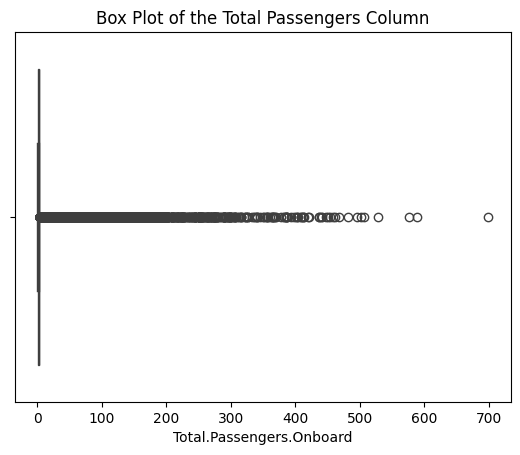

# Evaluating Aircraft Safety: A Risk Assessment Blueprint for Business Expansion in the Aviation Industry 
## Overview 
This project involves data cleaning, imputation, analysis, and visualization to generate insights for decision-making in purchasing and operating airplanes for commercial and private enterprises. The dataset was provided by the United States National Transportation Safety Board. This aviation accident data is from 1962 to 2023 and it is about civil aviation accidents and selected incidents in the United States and international waters.
## Business Understanding
#### Stakeholder and key business questions
Non-Technical Stakeholders - what make of aircraft is best suited for commercial and private business?
Data Managers/Scientists - what libraries were used to import, clean, analyse and visualize the data?

## Data Understanding and Analysis
#### Source of data
The dataset was provided by the United States National Transportation Safety Board. 
#### Description of data
This aviation accident data is from 1962 to 2023 and it is about civil aviation accidents and selected incidents in the United States and international waters.
#### Visualizations 
The top popular aircrafts by Make
)

Aircraft Makes that have had the most accidents and incidents
)

The most popular purposes/uses of Aircrafts
)

#### Conclusion
Boeing, Mcdonell, Airbus and Lockheed Aircrafts are the classified among the largest planes. 
Cessna, Piper, Beech and Bell are classified as medium to small capacity aircrafts.
Boeing, Cessna, Mcdonell, Piper and Airbus Aircrafts are the top 5 most popular aircrafts.
Cessna and Piper Aircrafts have been involved in the most accidents.
Most aircrafts are used for personal, Instructional, aerial application and business purposesly respectively.

### Reading and Loading the dataset
Use Pandas as pd to read the cvs file containing the dataset and load it

## Data Cleaning
Data cleaning involved striping leading and trailing spaces in categorical data, dropping collumns with over 60% null values, dropping duplicated values, filling null values in the integer columns with median of the respective column.
Created a new feature column with existing dataset to visualize and provide additional information

## Exploratory Data Analysis
The number of rows used in data analysis were 71189 count.

The new feature of Total Passengers per Aircraft were ploted and most popular shown as below:

The most popular aircrafts are:
)

The aircrafts with the highest number of accidents were:
)

The most popular purposes of aircrafts:
)

The largest aircrafts:
)

Medium capacity aircrafts
)

Small Aircrafts
)

